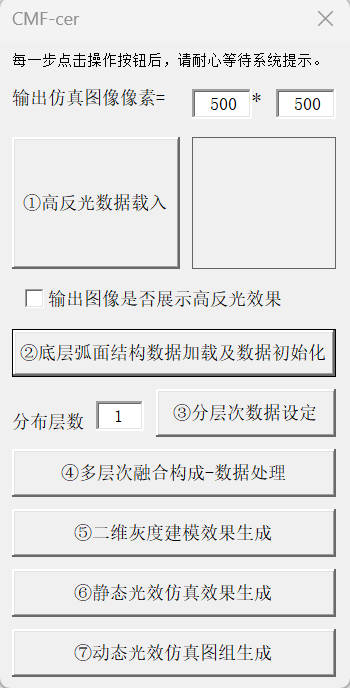

# CMF-Ceramic

This project focuses on the digital simulation of ceramic CMF (Color, Material & Finish), establishing a simulation system grounded in surface microstructural features. The system is built upon the micro-to-macro visual mapping mechanism revealed through microscopic observation, integrating physical characterization with digital technology. At the microscopic level, microstructural models are constructed based on microstructural features and visualized through two-dimensional grayscale images. At the macroscopic level, diffuse reflection and RGB color models are introduced to complete optical rendering. This cross-scale simulation strategy effectively bridges the visual gap between virtual and physical representations, faithfully reproducing the optical texture of ceramics and enabling reliable prediction of visual effects prior to firing. It provides a scientific basis for the precise optimization of formulations and processes, driving the transformation of ceramic CMF design from "experience-driven" to "scientifically controlled."

# CorelDRAW File Download link

[cdr](https://drive.google.com/file/d/1N7keFz4ceLU25zCgZeLZpF6Jste1ob3a/view?usp=drive_link)

# Use

## interface

interface1: 

Step1:

